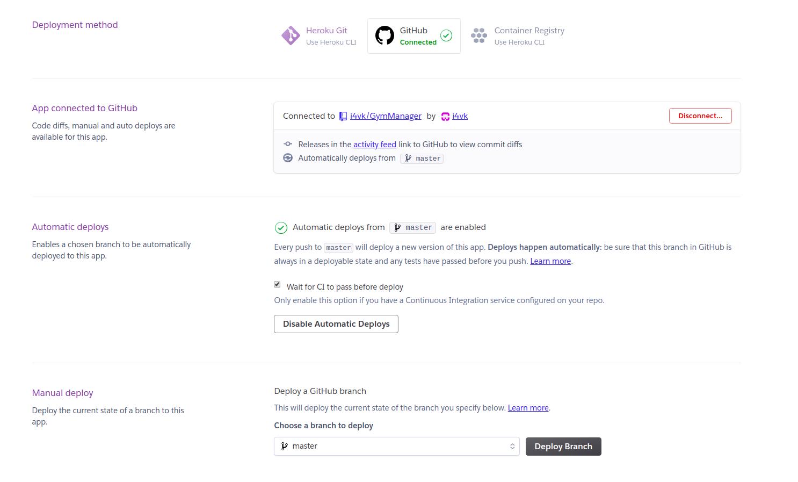
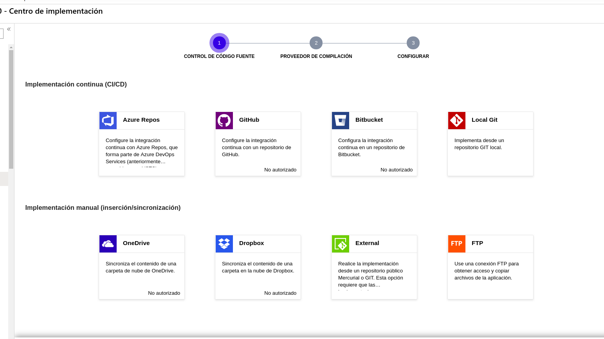
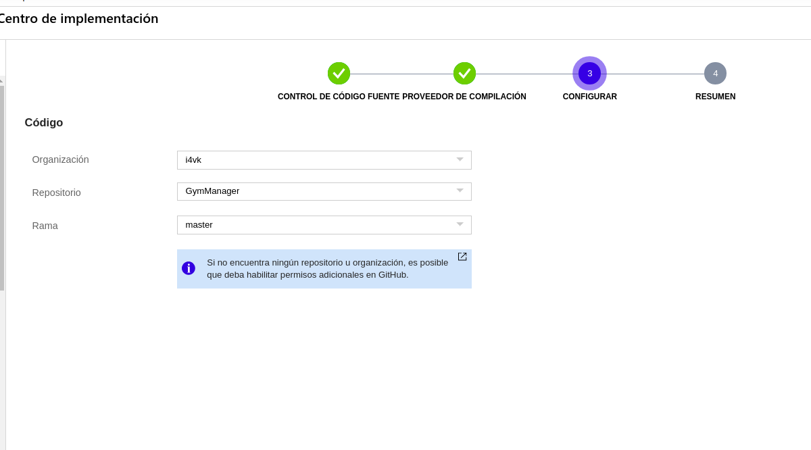

# Heroku

He decidido desplegar primero en heroku debido a su simplicidad y dado que no es necesario añadir una tarjeta de crédito para poder desplegar de manera gratuita.

Posteriormente intentaré hacer un despliegue en azure, pero para comenzar a habituarme con algún PaaS, he decidido hacerlo primero en Heroku.

Lo primero que debemos hacer para desplegarlo es descargarnos el CLI propio de Heroku, y posteriormente hacer login a nuestra cuenta de Heroku de la siguiente manera:

        $ heroku login

Tras esto, se abrirá una pestaña en nuestro navegador donde tendremos que iniciar sesión con nuestras credenciales de Heroku. Una vez hecho esto, nos indicará que hemos iniciado sesión correctamente y podremos continuar.

Ahora, lo que debemos hacer es crear nuestra app en heroku. Para ello, ejecutamos lo siguiente:

        $ heroku create

Esto nos creará una app de nombre aleatorio, que podremos modificar más adelante de la siguiente manera:

        $ heroku apps:rename gym-manager-iv-1920

Dado que no le hemos especificado ningún *buildpack*, heroku tomará uno por defecto que una stack para nuestro lenguaje predeterminado, en este caso *Node.js*. Sin embargo, este buildpack no tiene instalado por defecto la herramienta de construcción que yo utilizado, en este caso *Gulp*. Por lo tanto tenemos dos opciones, una es buscar un buildpack ya creado en github que integre esta herramienta de construcción, o crear uno nosotros mismos.

En este caso, dado que los buildpacks que había en internet no se ajustaban exactamente a lo que yo quería, he decidido tomar el buildpack oficial de heroku para *Node* y hacerle una modificación para añadir la funcionalidad que necesito. Para ello, he realizado un *fork* al repositorio del buildpack de *Node* a mi perfil de github. Posteriormente lo he clonado localmente, y he hecho la modificación necesaria. Un buildpack consta principalmente de tres scripts, *compile*, *detect* y *release*. En este caso, únicamente he tenido que modificar el script *compile*, para añadir una orden que instale gulp globalmente. Finalmente, una vez añadidos los cambios al repositorio de github, lo único que debemos hacer es indicarle a heroku que al desplegar la aplicación tome nuestro buildpack como referencia de la siguiente manera:

        $ heroku buildpacks:set https://github.com/i4vk/heroku-buildpack-nodejs

> **_NOTA:_**  Si se desea consultar, el repositorio del buildpack es el siguiente: [https://github.com/i4vk/heroku-buildpack-nodejs](https://github.com/i4vk/heroku-buildpack-nodejs)  
> Más concretamente, el cambio realizado se encuentra en la línea 263 del archivo *bin/compile*.

Una vez hecho esto, ya podemos crear el **Procfile**, que contendrá lo siguiente:

        web: gulp start-simple

Esto indicará a heroku lo que deberá ejecutar para arrancar el servidor.  
En este caso, arrancará con la tarea *start-simple* de gulp. Esta tarea la he añadido ya que heroku no necesita arrancar con pm2, ya que él mismo implementa balanceo de carga y el arranque de varias instancias. Por lo tanto esta tarea lo único que hace es arrancar el servidor sin pm2.

Una vez hecho esto, ya podríamos desplegar la aplicación ejecutando lo siguiente:

        $ git push heroku master

Sin embargo, existe una manera de no tener que subir los cambios a heroku manualmente, y que sea github el encargado de hacerlo siempre que se suban los cambios al repositorio, y se pasen los test.

Para ello, debemos ir a la configuración de la app desde la web de heroku, y en el apartado *Deploy* indicamos que se conecte con *GitHub*. Iniciamos sesión con nuestros datos de github, seleccionamos el repositorio y le activamos el despliegue automático, marcando la opción de esperar a la integración continua antes de realizar el despliegue. Finalmente, la configuración quedaría de la siguiente manera:

De esta manera ya tendríamos totalmente configurado el despliegue automático en Heroku.

# Azure

Posteriormente, y dado que gracias a Heroku ya me he hecho a la idea de cómo funciona exactamente un PaaS, he decidido hacer también el despliegue en Azure, para probar otro PaaS diferente. La elección de este ha sido porque disponemos de 100$ gratis por registrarnos con el correo de la UGR.

Para empezar, al igual que en Heroku, lo primero que debemos hacer es descargarnos el CLI, en este caso **az**, y posteriormente un login con azure, de la siguiente manera:

        $ az login

Esto nos abrirá una página en el navegador para que nos identifiquemos con nuestro usuario y contraseña. Una vez hecho esto, podemos proceder.

Ahora, lo primero que debemos hacer es crear la aplicación en azure. Para ello, antes debemos crear un grupo de recursos donde estará contenida nuestra aplicación.

        $ az group create --location westeurope --name GymManager

Al crearlo, le indicamos que el grupo de recursos estará situado en EUWest, y se llamará GymManager.

Posteriormente, para no tener que poner la localización y el nombre del grupo de recursos en todos los comandos que realicemos a partir de ahora, realizaremos lo siguiente:

        $ az configure --defaults  group=GymManager location=westeurope

Una vez hecho esto, definimos un plan de facturación, necesario para poder crear el servicio. En este caso, tomamos la opción gratuita de la siguiente manera:

        $ az appservice plan create --name free --sku F1

Ahora, ya podemos crear la aplicación, a la cual llamaré *gymmanager-iv-1920*:

        $ az webapp create --name gymmanager-iv-1920 --plan free

Le indicamos además el plan al que se acogerá.  
Posteriormente, una vez creada la aplicación, indicamos el usuario y la contraseña con la que nos identificaremos cada vez que realicemos un despliegue, y configuramos entonces el despliegue junto con Git de la siguiente manera:

        $ az webapp deployment source config-local-git --name gymmanager-iv-1920
        $ git remote add azure https://gymmanager-iv-1920.scm.azurewebsites.net/gymmanager-iv-1920.git

De esta manera, ya podemos hacer un push desde nuestro git local a azure. Si queremos desplegar entonces el código, haríamos:

        $ git push azure master

Sin embargo, al igual que hicimos en Heroku, queremos que el despliegue se haga directamente desde Github. Por lo tanto, vamos a proceder a configurarlo desde la web de azure. 

Para ello, lo primero que debemos hacer es desconectar el despliegue desde *local git*, y posteriormente nos saldrá un menú donde podremos seleccionar la opción de GitHub. Dicho menú es el siguiente:

Posteriormente, nos identificamos con nuestra cuenta de GitHub, y seleccionamos el repositorio y la rama desde la que queremos que se haga el despliegue, quedando entonces la configuración de la siguiente manera:

De esta manera ya tendríamos configurado el repositorio para que cada vez que se haga un push a github, se despliegue entonces a azure directamente.