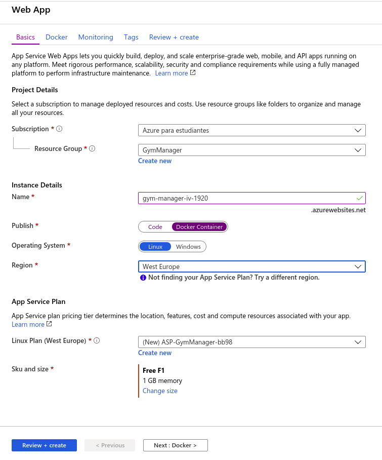
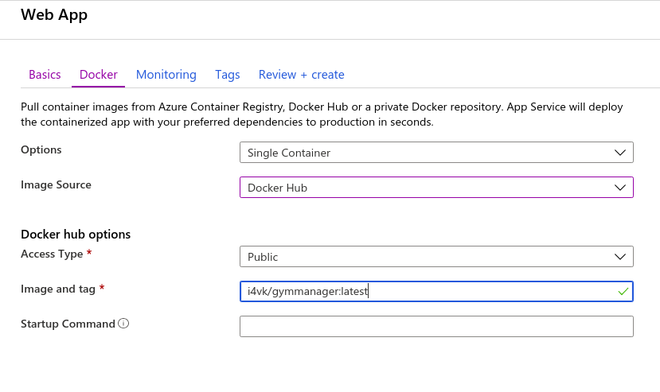

# Despliegue en Heroku

Lo primero que necesitamos para poder llevar a cabo el despliegue en Heroku es crear un fichero llamado *heroku.yml*. Esto se debe a que si vamos a usar contenedores, el antiguo *Procfile* no contiene la funcionalidad necesaria. Por lo tanto, a la hora del despliegue, por defecto se tomará el archivo *heroku.yml* como el archivo de configuración del despliegue.

Este archivo contiene lo siguiente:

        build:
            docker:
                web: Dockerfile

Con estas tres líneas, indicamos a Heroku que la construcción se realice a partir de un contenedor de Docker, y que este tome como fichero de configuración el Dockerfile que está situado en el repositorio.

Dado que ya tenemos una aplicación creada y desplegada en heroku, lo único que debemos hacer es modificarla para establecer que el despliegue en este caso se hará desde dicho contenedor de Docker.

Para ello, lo único que debemos hacer es lo siguiente:

        heroku stack:set container

Esta orden es justamente la que hace que por defecto, dado que el despliegue se ha marcado como de tipo contenedor, se busque el archivo *heroku.yml* en vez del antiguo *Procfile*. 

Una vez configurado esto, el siguiente despliegue que se haga será haciendo uso de dicho contenedor. Para desplegarlo manualmente, debemos ejecutar lo siguiente:

        git push heroku master

Sin embargo, dado que ya teníamos configurado el despliegue continuo desde GitHub, únicamente será necesario hacer push a nuestro repositorio, y una vez que se pasen los test, se desplegará automáticamente a Heroku.  

> **_NOTA:_**  Si se desea consultar cómo se hizo la configuración inicial de dicha aplicación de Heroku, así como el despliegue continuo desde Github, se debe consultar el siguiente [enlace](https://i4vk.github.io/GymManager/despliegue)

# Despliegue en Azure

En azure no podemos reutilizar nuestra aplicación anterior, debido a que en la configuración de la misma indicamos que el despliegue se haría desde el código fuente y no desde un contenedor, y no he encontrado una manera sencilla de cambiar esto.  
Por lo tanto, a la hora de crear la nueva, deberemos indicar que lo vamos a hacer desde un contenedor de Docker.

Para hacer esto, hay dos maneras de realizar el despliegue desde el contenedor. La primera de ellas es creando un repositorio en *Azure Container Registry* y subiendo ahí nuestra imagen, y hacer el despliegue desde dicho repositorio.  
La otra opción es hacer el despliegue del contenedor desde un repositorio de DockerHub. Sin embargo, esta opción no se puede llevar a cabo desde terminal, y hay que hacerlo únicamente desde la página web de azure.

Voy a optar por esta segunda opción, ya que previamente ya teníamos un despliegue de nuestra imagen en un repositorio de DockerHub, y este está correctamente configurado con despliegue continuo. Por lo tanto, cada vvez que hiciéramos un push a GitHub, si se pasan los test, se desplegaría la imagen a DockerHub, y posteriormente, dicha imagen se desplegaría en Azure.  
Si hubiéramos optado por la opción de *Azure Container Registry*, el despliegue continuo desde GitHub se hubiera complicado un poco.

Por lo tanto, vamos a comenzar con el despliegue. Para ello, lo primero que debemos hacer es crear una aplicación nueva desde el portal de Azure.  Al crear dicha aplicación nos saldrá la siguiente ventana de configuración, que la debemos dejar de la siguiente manera:

Aquí indicamos que el despliegue, en vez desde el código fuente, se hará desde un contenedor. Posteriormente, vamos a la ventana *Docker*, para configurar desde qué imagen se hará el despliegue. Esta ventana la configuraremos de la siguiente manera:

Ahora, simplemente le damos al botón de crear la aplicación y se comenzaría con el despliegue.  
Simplemente con esta configuación, cada vez que hagamos un push a Github, si se pasan los test, se desplegará nuestra imagen de docker a DockerHub, y finalmente, tras esto, se desplegaría la aplicación en azure.