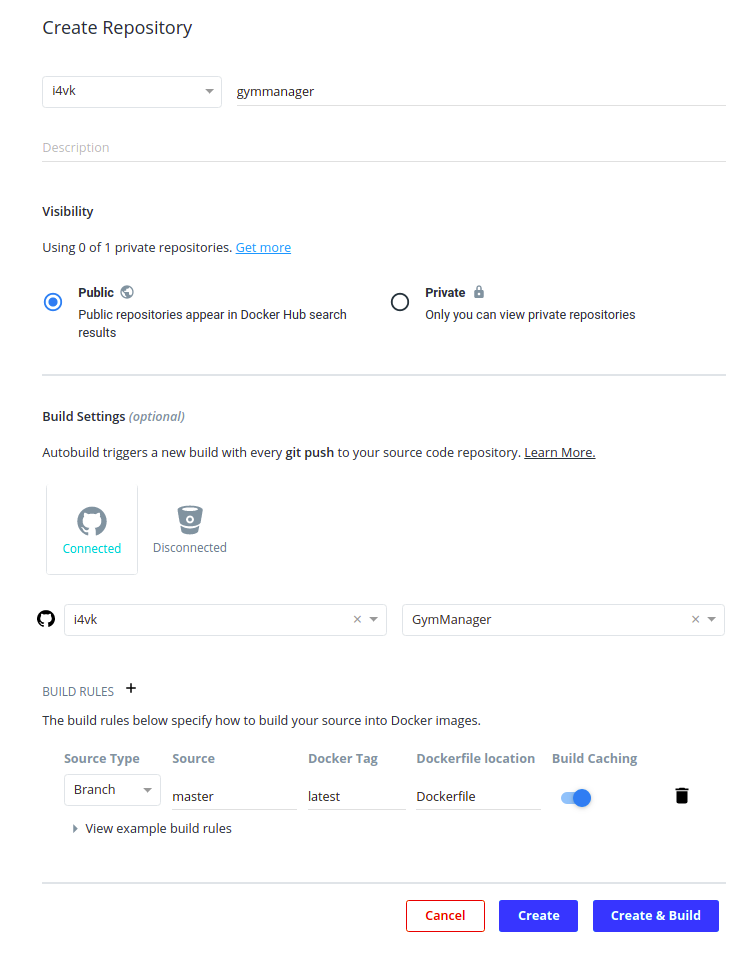
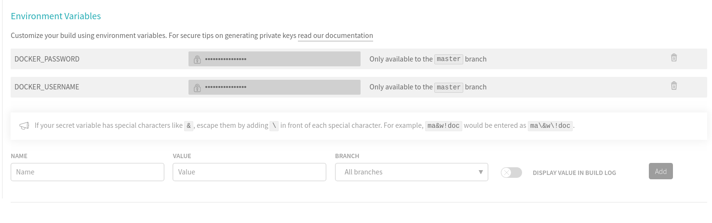

# Dockerfile

Para añadir virtualización a nuestro proyecto, y que este pueda ser desplegado más fácilmente, lo primero que debemos hacer es construir la propia imagen de Docker que contendrá nuestra aplicación.

El primer paso para ello consiste en crear un Dockerfile, que será el archivo de configuración a partir del cual se creará la imagen de la aplicación.  
En este archivo debemos indicar todos los pasos necesarios, así con la configuración necesaria para construir nuestro proyecto.  
Lo primero que debemos indicar en él es el sistema sobre el que se ejecutará virtualmente. En este caso, he decidido usar la versión oficial de *Node 10* sobre Alpine. Alpine es una distribución de Linux mucho menos pesada que las distribuciones de Ubuntu por ejemplo, por lo que de esta manera nuestro contenedor será bastante menos pesado que si hubieramos escogido dicha imagen.

        FROM node:10-alpine

Posteriormente, se indica alguna información del autor, pero esto es opcional.

        LABEL maintainer='Iván Garzón (ivangs98@gmail.com)'

Ahora es necesario definir el directorio de trabajo de nuestra aplicación dentro del sistema virtualizado, de la siguiente manera:

        WORKDIR /gymmanager

Posteriormente definimos el puerto en el que escuchará nuestra aplicación como una variable de entorno:

        ENV PORT 8080

A continuación, copiamos los archivos necesarios para poder poner en funcionamiento la aplicación al directorio de trabajo que definimos anteriormente. Es importante que únicamente copiemos los archivos que sean totalmente necesarios, porque añadir cosas de más hará que nuestra imagen sea más pesada.  

        COPY package.json ./
        COPY src ./src
        COPY gulpfile.js ./

En este caso, únicamente copiamos los archivos contenimos en el directorio *src*, que contiene los propios ficheros de la aplicación, y además de eso otros dos ficheros que son necesarios para poder arrancarla. Estos son el *package.json*, que contiene las dependencias de nuestra aplicación, y el *gulpfile.js*, que contiene las tareas necesarias para llevar a cabo el arranque de dicha aplicación.

Posteriormente instalamos las dependencias del proyecto de la siguiente manera:

        RUN npm install
        RUN install -g gulp

Sin embargo, esto instala también las dependencias de desarrollo, tales como las necesarias para compilar documentación, etc. Estas dependencias no son necesarias en producción, y únicamente añadirían tamaño a nuestra imagen. Por lo tanto, las eliminamos de la siguiente manera:

        RUN npm prune --production

Lo siguiente que haremos será indicar el comando que se usará para arrancar nuestra aplicación de la siguiente manera:

        CMD ["gulp", "start-simple"]

Y finalmente, *exponemos* el puerto en el que estará escuchando nuestra aplicación. Esto es importante dado que para hacer el posterior despliegue, algunos PaaS necesitan conocer el puerto de escucha para poder mapearlo posteriormente. Esto lo haremos de la siguiente manera:

        EXPOSE 8080

# Despliegue en DockerHub

DockerHub es una plataforma de alojamiento de repositorios que contienen imágenes de Docker creadas por la comunidad. Dado que hemos creado nuestra propia imagen, vamos a desplegarla en dicha plataforma. 

Para ello, lo primero que debemos hacer es crear un repositorio en dicha plataforma, configurándolo de la siguiente manera:

Como podemos observar en la parte de abajo de la imagen, hemos configurado el repositorio para que cada vez que se haga un *push* al repositorio de GitHub, automáticamente se construya una nueva imagen de Docker haciendo uso del Dockerfile de dicho repositorio, y posteriormente se despliegue.

Si ahora pulsamos el botón de *Create & Build*, haremos que se produzca el primer despliegue desde el propio repositorio de GitHub que tenemos configurado.

De esta manera, ya tendremos nuestra imagen desplegada en DockerHub, y cada vez que hagamos un push a nuestro repositorio de GitHub posteriormente se desplegará nuestra imagen actualizada.

Para descargarla, únicamente sería necesario ejecutar lo siguiente:

        docker pull i4vk/gymmanager:latest

Con esto descargaremos la última versión de la imagen desde el repositorio de DockerHub.

Sin embargo, esto no nos asegura que el despliegue en DockerHub se realice después de que se pasen los test, por lo cual, podría darse el caso de desplegar una versión errónea de la aplicación. Para solucionarlo, la única solución posible pasa por realizar el despliegue desde el propio Travis.  
Para ello, debemos modificar el archivo *.travis.yml*, para añadir esa funcionalidad. Este estará documentado en el siguiente [enlace](https://i4vk.github.io/GymManager/doc_CI).

Sin embargo, la parte importante de dicho archivo que nos permitirá realizar el despliegue es la siguiente:

        deploy:
           provider: script
           script: sh docker_push.sh
           on:
              branch: master

Con este bloque, lo que le indicamos es que se realice un despliegue (si se pasan los test), haciendo uso del script *docker_push.sh* para realizarlo. Además indicamos que esto únicamente se haga sobre la rama master. 

Como vemos, hacemos uso de un script para automatizar el despliegue con Travis. Este fichero contiene lo siguiente:

        #!/bin/bash

        docker login -u $DOCKER_USERNAME -p $DOCKER_PASSWORD
        docker build -t gymmanager .
        docker tag gymmanager i4vk/gymmanager
        docker push i4vk/gymmanager

Básicamente, el funcionamiento de este script consiste en que primero se logea en DockerHub, usando nuestras credenciales de dicha plataforma. Estas credenciales estarán definidas como variables de entorno en el propio Travis, por motivos de seguridad, ya que no la podemos poner directamente en este fichero ya que serían visibles a todo el mundo.  
Para definir dichas variables, debemos acceder a la configuración del repositorio desde la web de Travis, y bajar hasta la sección de *Variables de entorno*. Una vez ahí, las definimos de la siguiente manera:

Una vez se ha hecho el login, posteriormente se pasa a construír la imagen que posteriormente será desplegada. A esta imagen se le asocia un tag, y finalmente se hace un push al repositorio correspondiente.

De esta manera, ya tendríamos totalmente configurado el despliegue continuo de nuestra imagen cada vez que hagamos un push a nuestro repositorio de GitHub.  
Era importante hacer este paso de comprobar si se pasan los test antes de desplegar a DockerHub ya que posteriormente, como se podrá ver en la documentación del despliegue, al realizar dicho despliegue en Azure, tomará siempre la imagen desde el repositorio de DockerHub, y por lo tanto, es importante que dicho repositorio siempre tenga una versión correcta de la aplicación.